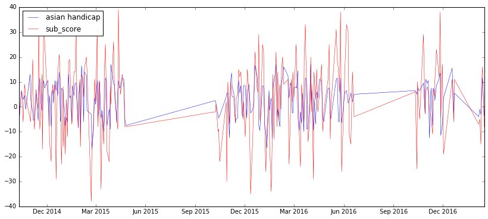

## I assume that matchup sub-score is related to asian handicap given
So let's plot the asian handicap and sub-score to try to have a look.

Houston Rockets


Golden_State_Warriors


Cleveland_Cavaliers




```python
# Table of game winning info
```


<div>
<table border="1" class="dataframe">
  <thead>
    <tr style="text-align: right;">
      <th></th>
      <th>team</th>
      <th>total_away_games</th>
      <th>total_away_games_win</th>
      <th>total_away_ah_win</th>
      <th>total_home_games</th>
      <th>total_home_games_win</th>
      <th>total_home_ah_win</th>
      <th>games_win_percent</th>
      <th>ah_win_percent</th>
    </tr>
  </thead>
  <tbody>
    <tr>
      <th>1</th>
      <td>Boston_Celtics</td>
      <td>123</td>
      <td>59</td>
      <td>71</td>
      <td>117</td>
      <td>69</td>
      <td>63</td>
      <td>0.533333</td>
      <td>0.558333</td>
    </tr>
    <tr>
      <th>10</th>
      <td>Houston_Rockets</td>
      <td>127</td>
      <td>68</td>
      <td>68</td>
      <td>115</td>
      <td>76</td>
      <td>64</td>
      <td>0.595041</td>
      <td>0.545455</td>
    </tr>
    <tr>
      <th>8</th>
      <td>Detroit_Pistons</td>
      <td>122</td>
      <td>49</td>
      <td>62</td>
      <td>117</td>
      <td>64</td>
      <td>68</td>
      <td>0.472803</td>
      <td>0.543933</td>
    </tr>
    <tr>
      <th>0</th>
      <td>Atlanta_Hawks</td>
      <td>127</td>
      <td>68</td>
      <td>68</td>
      <td>122</td>
      <td>90</td>
      <td>67</td>
      <td>0.634538</td>
      <td>0.542169</td>
    </tr>
    <tr>
      <th>28</th>
      <td>Utah_Jazz</td>
      <td>116</td>
      <td>53</td>
      <td>65</td>
      <td>115</td>
      <td>63</td>
      <td>60</td>
      <td>0.502165</td>
      <td>0.541126</td>
    </tr>
    <tr>
      <th>9</th>
      <td>Golden_State_Warriors</td>
      <td>127</td>
      <td>90</td>
      <td>63</td>
      <td>133</td>
      <td>122</td>
      <td>75</td>
      <td>0.815385</td>
      <td>0.530769</td>
    </tr>
    <tr>
      <th>14</th>
      <td>Memphis_Grizzlies</td>
      <td>120</td>
      <td>61</td>
      <td>59</td>
      <td>120</td>
      <td>81</td>
      <td>68</td>
      <td>0.591667</td>
      <td>0.529167</td>
    </tr>
    <tr>
      <th>3</th>
      <td>Charlotte_Hornets</td>
      <td>121</td>
      <td>51</td>
      <td>71</td>
      <td>114</td>
      <td>66</td>
      <td>51</td>
      <td>0.497872</td>
      <td>0.519149</td>
    </tr>
    <tr>
      <th>7</th>
      <td>Denver_Nuggets</td>
      <td>121</td>
      <td>39</td>
      <td>65</td>
      <td>116</td>
      <td>55</td>
      <td>57</td>
      <td>0.396624</td>
      <td>0.514768</td>
    </tr>
    <tr>
      <th>16</th>
      <td>Milwaukee_Bucks</td>
      <td>123</td>
      <td>46</td>
      <td>66</td>
      <td>116</td>
      <td>62</td>
      <td>56</td>
      <td>0.451883</td>
      <td>0.510460</td>
    </tr>
    <tr>
      <th>26</th>
      <td>San_Antonio_Spurs</td>
      <td>123</td>
      <td>76</td>
      <td>61</td>
      <td>122</td>
      <td>98</td>
      <td>64</td>
      <td>0.710204</td>
      <td>0.510204</td>
    </tr>
    <tr>
      <th>21</th>
      <td>Orlando_Magic</td>
      <td>113</td>
      <td>36</td>
      <td>63</td>
      <td>119</td>
      <td>51</td>
      <td>55</td>
      <td>0.375000</td>
      <td>0.508621</td>
    </tr>
    <tr>
      <th>18</th>
      <td>New_Orleans_Pelicans</td>
      <td>121</td>
      <td>37</td>
      <td>58</td>
      <td>118</td>
      <td>68</td>
      <td>63</td>
      <td>0.439331</td>
      <td>0.506276</td>
    </tr>
    <tr>
      <th>11</th>
      <td>Indiana_Pacers</td>
      <td>112</td>
      <td>45</td>
      <td>54</td>
      <td>123</td>
      <td>77</td>
      <td>64</td>
      <td>0.519149</td>
      <td>0.502128</td>
    </tr>
    <tr>
      <th>15</th>
      <td>Miami_Heat</td>
      <td>114</td>
      <td>51</td>
      <td>57</td>
      <td>130</td>
      <td>67</td>
      <td>65</td>
      <td>0.483607</td>
      <td>0.500000</td>
    </tr>
    <tr>
      <th>2</th>
      <td>Brooklyn_Nets</td>
      <td>111</td>
      <td>34</td>
      <td>60</td>
      <td>119</td>
      <td>48</td>
      <td>55</td>
      <td>0.356522</td>
      <td>0.500000</td>
    </tr>
    <tr>
      <th>23</th>
      <td>Phoenix_Suns</td>
      <td>121</td>
      <td>41</td>
      <td>61</td>
      <td>107</td>
      <td>48</td>
      <td>52</td>
      <td>0.390351</td>
      <td>0.495614</td>
    </tr>
    <tr>
      <th>27</th>
      <td>Toronto_Raptors</td>
      <td>130</td>
      <td>70</td>
      <td>65</td>
      <td>122</td>
      <td>85</td>
      <td>59</td>
      <td>0.615079</td>
      <td>0.492063</td>
    </tr>
    <tr>
      <th>29</th>
      <td>Washington_Wizards</td>
      <td>117</td>
      <td>51</td>
      <td>57</td>
      <td>118</td>
      <td>76</td>
      <td>58</td>
      <td>0.540426</td>
      <td>0.489362</td>
    </tr>
    <tr>
      <th>13</th>
      <td>Los_Angeles_Lakers</td>
      <td>110</td>
      <td>22</td>
      <td>54</td>
      <td>125</td>
      <td>39</td>
      <td>59</td>
      <td>0.259574</td>
      <td>0.480851</td>
    </tr>
    <tr>
      <th>24</th>
      <td>Portland_Trail_Blazers</td>
      <td>127</td>
      <td>50</td>
      <td>58</td>
      <td>117</td>
      <td>81</td>
      <td>59</td>
      <td>0.536885</td>
      <td>0.479508</td>
    </tr>
    <tr>
      <th>6</th>
      <td>Dallas_Mavericks</td>
      <td>122</td>
      <td>51</td>
      <td>58</td>
      <td>120</td>
      <td>67</td>
      <td>58</td>
      <td>0.487603</td>
      <td>0.479339</td>
    </tr>
    <tr>
      <th>5</th>
      <td>Cleveland_Cavaliers</td>
      <td>125</td>
      <td>73</td>
      <td>58</td>
      <td>131</td>
      <td>99</td>
      <td>64</td>
      <td>0.671875</td>
      <td>0.476562</td>
    </tr>
    <tr>
      <th>20</th>
      <td>Oklahoma_City_Thunder</td>
      <td>120</td>
      <td>55</td>
      <td>50</td>
      <td>129</td>
      <td>93</td>
      <td>68</td>
      <td>0.594378</td>
      <td>0.473896</td>
    </tr>
    <tr>
      <th>4</th>
      <td>Chicago_Bulls</td>
      <td>119</td>
      <td>57</td>
      <td>57</td>
      <td>120</td>
      <td>77</td>
      <td>56</td>
      <td>0.560669</td>
      <td>0.472803</td>
    </tr>
    <tr>
      <th>12</th>
      <td>Los_Angeles_Clippers</td>
      <td>127</td>
      <td>74</td>
      <td>62</td>
      <td>121</td>
      <td>84</td>
      <td>53</td>
      <td>0.637097</td>
      <td>0.463710</td>
    </tr>
    <tr>
      <th>19</th>
      <td>New_York_Knicks</td>
      <td>108</td>
      <td>30</td>
      <td>54</td>
      <td>117</td>
      <td>44</td>
      <td>50</td>
      <td>0.328889</td>
      <td>0.462222</td>
    </tr>
    <tr>
      <th>22</th>
      <td>Philadelphia_76ers</td>
      <td>114</td>
      <td>14</td>
      <td>48</td>
      <td>116</td>
      <td>32</td>
      <td>58</td>
      <td>0.200000</td>
      <td>0.460870</td>
    </tr>
    <tr>
      <th>17</th>
      <td>Minnesota_Timberwolves</td>
      <td>112</td>
      <td>29</td>
      <td>54</td>
      <td>120</td>
      <td>37</td>
      <td>51</td>
      <td>0.284483</td>
      <td>0.452586</td>
    </tr>
    <tr>
      <th>25</th>
      <td>Sacramento_Kings</td>
      <td>118</td>
      <td>40</td>
      <td>52</td>
      <td>112</td>
      <td>52</td>
      <td>52</td>
      <td>0.400000</td>
      <td>0.452174</td>
    </tr>
  </tbody>
</table>
</div>


```python
# chart of winning games and winning ah per teams
```


From above table and chart, I can see that some teams win the game over the asian handicap like Boston/Houston/Memphis with some percentage like 54~55% and some other like Philadelphia or LAL lost games and lost bet. Seem these teams can be better predictable in the model.


```python

```
